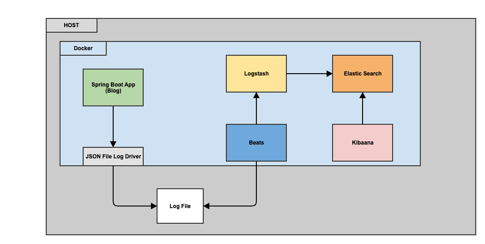

# Log Aggregation with Springboot, Elastic and Docker

## Components
- Blog Appliation : A simple springboot application which manages posts and comments. Spring Cloud Slueth is used to manage distributed tracing of api calls. LogstashEncoder is used to generate logs in json format.
- Beats : An open source data shippers that can be installed as agents on servers to send operational data to Elasticsearch via Logstash
- Logstash : Collects log data through Filebeat agents, add additional tags and pushes the messages to Elastic.
- Elastic : Storage of log data and indexes.
- Kibaana : A visualization tool to view data from elastic datasource

## Running on Docker


Springboot app is a simple api which reads and writes blog data along with comments in a Hashmap. The api has the following :
-  Integrated with Slueth for distributed tracing
-  Log appender using LogstashEncoder to write log files. (In mac there was no option for streaming log contents directly from the docker containers)
-  Enabled prometheus through micrometer.
-  Swagger url is enabled at the following endpoint - http://localhost:9001/blog/v1/swagger-ui/index.html#/

To stream logs we will use Beats which will continously monitor the logs folder and pushes the messages to Logstash.

Logstash is used to pre-process messages and in this case there are additional tags are added and forwards the messages to Elastic container.

Elastic Search is started in a single node cluster to which can be viewed in Kibaana. Once logged into Kibaana create an index by searching for "logstash*" and view the logs being streamed realtime.

The blog application metrics using prometheus can be viewed using the url - http://localhost:9001/blog/v1/management/prometheus. The prometheus container scrapes the metrics data every 5 seconds. The [target url](http://localhost:9090/targets)  can be used to verify if prometheus data is scraped correctly. The state should be up. Generate a sample [graph](http://localhost:9090/graph?g0.range_input=1h&g0.expr=jvm_memory_max_bytes&g0.tab=0). Once the metrics is scraped the visualization can be viewed using Grafana. There are multiple dashboards which can be imported in Grafana, a sample dashboard is - [4701](https://grafana.com/grafana/dashboards/4701)


## Local Setup
- Clean and build the spring boot application using gradle.
  ```
  $ cd blog
  $ ./gradlew clean build
  ```
- Build all the docker images required for the application using docker-compose commands
  ```
  $ docker-compose build
  ```
- Start all the application using docker-compose.
  ```
  $ docker-compose up -d
  ```
